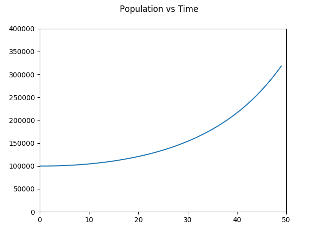

# What Is this course?

## What is a Mathematical Model?
Some collection of mathematical objects that represent the behavior of real-world things.
1. Meant to answer a question.
2. The best model is the **simplest** one that permits you to answer your question.

## What Types of Mathematical Models Exist?

#### Mainly Two Types:
Type | Definition | Model Type | Example
--- | --- | --- | ---
**Empirical** | Relating to data | Model based on observations that already exist, generally using regression to fit data points | If we wanted an empirical model for population growth, we would get a bunch a data points for population at different times, and use regression to find a curve to follow, and we could predict the population at other times by following that.
**Mechanistic** | Relating to purely deterministic terms | Model based on logically determined relationships at other levels of the model (where you presumably have more knowledge) | If you wanted a model for population growth, we could do this: ``` P = population, P' = Rate of population growth ``` <br> Assume that the same proportion of the population are reproducing at all times. ``` P' = kP ``` could be a basic mechanistic model.

#### Empirical Model Example: Population vs. Time
Using this python code:
```python
import matplotlib.pyplot as plt
import numpy as np

fig = plt.figure()
fig.suptitle("Population vs Time")

pop = 100000
k = 0.01

x = []
y = []

for t in range(0, 50, 1):
    popPrime = pop*k
    x.append(t)
    y.append(pop)
    #print("Population: %.2f Population': %.2f Time: %.2f" % (pop, popPrime, t))
    pop += popPrime * t/10

plt.plot(x, y)
plt.axis([0, 50, 0, 400000])
plt.show()
```

I generated this graph:



#### Other stuff
Systems are generally simplified with assumptions, as trying to figure out every single thing that affects every other thing is insane.

## The Mathematical Modeling Process
1. Ask a question
2. Identify factors that affect the question
3. Simplify with assumptions

## What is a Numerical Simulation?